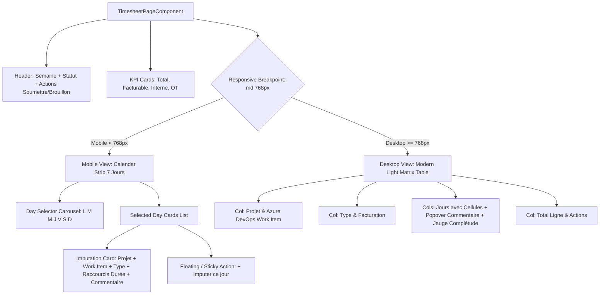

# TICKET-0021 — Refonte UX/UI Feuille de temps : Vue Mobile-First (Calendar Strip & Day Cards), Grille Desktop Thème Light & Work Items Azure DevOps

## 1. Objectif

Moderniser la feuille de temps (CRA) de TimeFlow en s'inspirant des meilleures pratiques de YouTrack (JetBrains) et des applications de productivité modernes (Linear, Toggl) :
1. **Ergonomie & Beauté UI Mobile-First** : Remplacer la grille matricielle tronquée sur mobile par un bandeau de sélection journalière tactile (**Calendar Strip**) et des cartes d'imputations journalières (**Day Cards**) avec presets tactiles (`+15m`, `+30m`, `+1h`, `3.5h`, `7h`), tout en sublimant la grille Desktop en **Thème Light épuré**.
2. **Granularité Work Items & Commentaires Journaliers** : Permettre d'associer les imputations à un Work Item Azure DevOps (ID et titre) et d'ajouter un commentaire contextuel par jour/imputation (et plus seulement un commentaire unique par ligne hebdomadaire).
3. **Architecture, Sécurité & Anti-régression** : Conserver le backend maître absolu des calculs (heures sup OT/ET, plafonds légaux, jours fériés, validation manager) et garantir la rétrocompatibilité totale avec les feuilles de temps existantes.

---

## 2. Critères d'acceptation

- [x] **CA-01 (Backend - Données & Migration)** :
  - Migration Flyway `V12__time_entry_work_item_and_entry_comments.sql` ajoutant sur `time_entry` :
    - `work_item_id VARCHAR(100)` (nullable, ex: "1423", "US-42").
    - `work_item_title VARCHAR(255)` (nullable, titre de la tâche Azure DevOps).
    - Index d'optimisation `idx_time_entry_work_item_id`.
  - Préservation intégrale des données existantes sans perte ni altération.

- [x] **CA-02 (Backend - Contrat d'API & Rétrocompatibilité)** :
  - Mise à jour de `SaveTimesheetCommand` :
    - `LineCommand` accepte optionnellement `workItemId` et `workItemTitle`.
    - `EntryCommand` accepte un `comment` (jusqu'à 1000 caractères) spécifique au jour.
    - Règle de fallback : si `EntryCommand.comment` est renseigné, il est persisté pour cette date ; sinon, il hérite de `LineCommand.comment`.
  - Mise à jour de `TimesheetOverview` :
    - `TimesheetLineOverview` expose `workItemId` et `workItemTitle`.
    - `DayEntryOverview` expose `comment`.

- [x] **CA-03 (Backend - Métier & Sécurité)** :
  - `TimesheetPolicy` et `TimesheetService` valident la cohérence des dates, des plafonds journaliers (max 1440 min) et des totaux.
  - Calcul et exposition des heures supplémentaires OT et ET préservés.
  - Isolation stricte des utilisateurs (`deny-by-default`, vérification de l'appartenance de la feuille à l'utilisateur connecté).

- [x] **CA-04 (Frontend - Vue Mobile « Calendar Strip + Day Cards »)** :
  - Sur écrans étroits (`< 768px`) :
    - Affichage d'un **Calendar Strip sticky** avec 7 jours interactifs (Lun à Dim).
    - Chaque jour affiche son abréviation, son jour du mois, un badge visuel si férié/chômé, et une pastille/jauge d'avancement (gris = 0h, ambre = partiel, vert émeraude = 7h/cible atteinte, violet = dépassement/OT).
    - Un tap sur un jour affiche les imputations de cette journée sous forme de **cartes individuelles**.
    - Chaque carte affiche : Projet, Work Item (si renseigné), badge d'activité, statut facturable, commentaire du jour éditable, et contrôles de saisie tactiles rapides (`-1h`, `-15m`, input digital, `+15m`, `+1h`, presets `3.5h` et `7h`).
    - Bouton tactile visible `+ Imputer sur ce jour` ouvrant la sélection rapide de projet/tâche.

- [x] **CA-05 (Frontend - Grille Desktop Thème Light & Popover Commentaire)** :
  - Sur écrans larges (`>= 768px`) :
    - Grille matricielle haute fidélité en Thème Light : fonds `bg-white` et `bg-slate-50`, bordures fines `border-slate-200/80`, typographie nette avec `tabular-nums`.
    - Sous chaque total journalier, barre de progression visuelle indiquant la complétude par rapport à la cible quotidienne (ex: 7h).
    - Dans chaque cellule de saisie : petit indicateur discret pour ouvrir un **popover de commentaire journalier** (icône bulle ou raccourci clavier), reflétant le modèle de saisie YouTrack.
    - Affichage élégant du Work Item Azure DevOps en sous-titre du nom de projet.

- [x] **CA-06 (Frontend - Thème Clair & Palette Visuelle TimeFlow v0.1)** :
  - Respect strict de la charte graphique :
    - Primaire : Indigo `#4F46E5` / `#4338CA`.
    - Validation & Facturable : Émeraude / Teal `#059669`.
    - Heures sup & Formations : Violet `#7C3AED`.
    - Alertes & Erreurs : Ambre doux et Rose poudré.
    - Accessibilité contrastes WCAG AA minimum.

- [x] **CA-07 (Tests & Non-régression)** :
  - Tests unitaires Java du domaine et du service (`TimesheetPolicyTest`, `TimesheetServiceTest`).
  - Tests MockMvc de sécurité (`TimesheetSecurityTest`).
  - Tests frontend Angular (transformation des DTOs, navigation par jours du calendar strip, calculs en temps réel).
  - `mvn test` (213 tests au vert) et `npm test` (55 tests au vert), build Angular 0 warning / 0 erreur.

---

## 3. Contexte analysé

- **Base de données existante** :
  - Table `timesheet` : `id`, `user_id`, `week_start`, `status`, `submitted_at`, `validated_at`, `locked_at`, etc.
  - Table `time_entry` : `id`, `timesheet_id`, `project_id`, `activity_type`, `entry_date`, `minutes`, `billable`, `comment`.
  - Constat : `time_entry.comment` existe déjà en BDD, mais le frontend et `SaveTimesheetCommand` le traitaient comme un champ global de ligne (`LineCommand`).
- **Contrats d'API existants** :
  - `GET /api/v1/timesheets?weekStart=YYYY-MM-DD`
  - `PUT /api/v1/timesheets/{weekStart}` (`SaveTimesheetCommand`)
  - `POST /api/v1/timesheets/{weekStart}/submit`
- **Composants Frontend existants** :
  - `TimesheetPageComponent` (`features/timesheets/timesheet-page.component.ts`) : gère la grille matricielle unique dans une balise `<table class="min-w-[46rem]">`.
  - `TimesheetSidePanelComponent` : synthétise les totaux, statuts et rappels.

---

## 4. Architecture & Maquettes Techniques

### A. Structure Frontend Responsive (Angular 22 Standalone + Tailwind CSS v4)



### B. Maquette HTML/Tailwind : Calendar Strip Mobile

```html
<!-- Calendar Strip Mobile (Sticky sous le header) -->
<div class="md:hidden sticky top-16 z-20 -mx-4 px-4 py-3 bg-surface/95 backdrop-blur-xs border-b border-border">
  <div class="flex items-center justify-between gap-1.5">
    @for (day of week().days; track day.isoDate) {
      <button
        type="button"
        (click)="selectMobileDay(day.isoDate)"
        [class]="selectedMobileDate() === day.isoDate
          ? 'bg-brand-600 text-white shadow-xs ring-2 ring-brand-600/30'
          : 'bg-surface text-foreground hover:bg-app border border-border'"
        class="flex flex-1 flex-col items-center py-2 px-1 rounded-xl transition text-center min-w-0">
        <span class="text-[10px] font-semibold uppercase tracking-wider opacity-80">{{ day.shortLabel }}</span>
        <span class="text-sm font-bold tabular-nums">{{ day.dayOfMonth }}</span>
        
        <!-- Indicateur d'avancement journalier -->
        <div class="mt-1 flex items-center justify-center">
          @if (day.holiday) {
            <span class="size-1.5 rounded-full bg-purple-500"></span>
          } @else if ((dailyTotals()[day.isoDate] || 0) >= targetDayHours()) {
            <span class="size-1.5 rounded-full bg-emerald-500"></span>
          } @else if ((dailyTotals()[day.isoDate] || 0) > 0) {
            <span class="size-1.5 rounded-full bg-amber-500"></span>
          } @else {
            <span class="size-1.5 rounded-full bg-slate-300 dark:bg-slate-700"></span>
          }
        </div>
      </button>
    }
  </div>
</div>
```

### C. Maquette HTML/Tailwind : Carte d'imputation journalière (Mobile)

```html
<!-- Carte d'imputation unitaire sur le jour sélectionné -->
<div class="rounded-ui border border-border bg-surface p-4 shadow-xs space-y-3">
  <div class="flex items-start justify-between gap-3">
    <div>
      <h4 class="font-bold text-foreground text-sm leading-snug">{{ row.projectName }}</h4>
      @if (row.workItemTitle) {
        <p class="text-xs text-brand-600 font-medium flex items-center gap-1 mt-0.5">
          <tf-icon name="git-pull-request" [size]="12" />
          <span>#{{ row.workItemId }} · {{ row.workItemTitle }}</span>
        </p>
      }
    </div>
    <span class="inline-flex items-center rounded-full px-2 py-0.5 text-[11px] font-medium border border-border"
      [class]="activityBadgeClass(row.activityType)">
      {{ activityLabel(row.activityType) }}
    </span>
  </div>

  <!-- Saisie tactile de la durée avec raccourcis -->
  <div class="flex items-center justify-between gap-2 pt-2 border-t border-border/60">
    <div class="flex items-center gap-1.5">
      <button type="button" (click)="adjustHours(row, selectedDate(), -0.5)" class="size-9 rounded-lg border border-border bg-app grid place-items-center text-foreground font-bold">-0.5</button>
      <input type="number" step="0.5" [(ngModel)]="row.hoursByDate[selectedDate()]" class="w-16 h-9 rounded-lg border border-border bg-surface text-center font-bold tabular-nums" />
      <button type="button" (click)="adjustHours(row, selectedDate(), +0.5)" class="size-9 rounded-lg border border-border bg-app grid place-items-center text-foreground font-bold">+0.5</button>
    </div>
    <div class="flex items-center gap-1">
      <button type="button" (click)="setHours(row, selectedDate(), 3.5)" class="px-2 py-1.5 text-xs font-semibold rounded-md border border-border hover:bg-app">3.5h</button>
      <button type="button" (click)="setHours(row, selectedDate(), 7.0)" class="px-2 py-1.5 text-xs font-semibold rounded-md border border-border hover:bg-app">7h</button>
    </div>
  </div>

  <!-- Commentaire journalier -->
  <div>
    <input type="text" [(ngModel)]="row.commentsByDate[selectedDate()]" placeholder="Qu'avez-vous fait aujourd'hui ? (optionnel)" class="w-full text-xs rounded-lg border border-border bg-surface px-3 py-2 text-foreground focus:border-brand-600 focus:outline-none" />
  </div>
</div>
```

---

## 5. Plan d'action détaillé

### Étape 1 : Base de données & Migration Flyway
1. Créer `backend/src/main/resources/db/migration/V12__time_entry_work_item_and_entry_comments.sql` :
   - Ajouter `work_item_id VARCHAR(100)` et `work_item_title VARCHAR(255)` sur `time_entry`.
   - Créer l'index `idx_time_entry_work_item ON time_entry(work_item_id)`.

### Étape 2 : Backend (Modèle, DTOs, Use Cases)
1. Mettre à jour `TimeEntryEntity` : champs `workItemId`, `workItemTitle`.
2. Mettre à jour `SaveTimesheetCommand` :
   - Ajouter `workItemId`, `workItemTitle` dans `LineCommand`.
   - Ajouter `comment` dans `EntryCommand`.
3. Mettre à jour `TimesheetOverview` :
   - Ajouter `workItemId`, `workItemTitle` dans `TimesheetLineOverview`.
   - Ajouter `comment` dans `DayEntryOverview`.
4. Adapter `TimesheetService` :
   - Persister les work items et les commentaires journaliers lors du remplacement des entrées en brouillon.
   - Préserver la règle de calcul des métriques et des totaux.

### Étape 3 : Frontend (Modèles & Services)
1. Mettre à jour `frontend/src/app/features/timesheets/timesheet.models.ts` :
   - Adapter les interfaces TypeScript pour porter `workItemId`, `workItemTitle` et `comment` par jour.
2. Adapter `timesheet.service.ts` pour sérialiser et désérialiser correctement la nouvelle structure.

### Étape 4 : Frontend (Composants UI & Thème Light)
1. Implémenter le composant responsive hybride dans `timesheet-page.component.ts` et `timesheet-page.component.html` :
   - Vue Mobile (`<div class="block md:hidden">`) : Calendar Strip sticky + cartes d'imputation journalières + contrôles tactiles rapides.
   - Vue Desktop (`<div class="hidden md:block">`) : Grille matricielle raffinée, sous-titres Azure DevOps Work Items, popover de commentaire unitaire, barres de complétude quotidiennes.
2. Enrichir et refondre la modale d'ajout d'une ligne selon le standard YouTrack / Linear :
   - Remplacement de la grille 3 colonnes tronquée par un bloc Work Item dédié avec préfixe `#` intégré, champs ID et Titre harmonieux sans troncature.
   - Grille 2 colonnes équilibrée pour Projet (avec badge requis) et Type d'activité, avec chevrons personnalisés.
   - Remplacement de la checkbox brute par une carte interactive stylisée pour la facturabilité.
   - En-tête avec badge d'icône, typographie soignée et bouton de fermeture `×`.
   - Harmonisation identique pour la modale de saisie de commentaire journalier.
3. Soigner le Thème Light et Dark avec la palette TimeFlow Indigo/Violet/Teal/Slate.

### Étape 5 : Tests & Vérifications
1. Tests unitaires Spring Boot :
   - `TimesheetServiceTest` : persistance des work items, persistance des commentaires journaliers, non-régression des totaux.
   - `TimesheetSecurityTest` : vérification des autorisations.
2. Tests Frontend Angular :
   - Tests de composant pour la sélection des jours du Calendar Strip et le calcul des totaux.
3. Exécution globale : `mvn test` et `npm run build`.

---

## 6. Tests et vérifications exécutés

- [x] Tests unitaires backend complets (`mvn test` : 213 tests au vert, 0 échec).
- [x] Tests frontend Node test runner (`npm test` : 55 tests au vert, 0 échec).
- [x] Tests de compilation TypeScript & build Angular (`npm run build` : 0 erreur, 0 warning).
- [x] Rendu Desktop Thème Light (grille matricielle, contrastes, popover commentaire).
- [x] Rendu Mobile (Calendar Strip, cartes tactiles, boutons `-½`, `+½`, `3.5h`, `7h`).
- [x] Rendu Thème Dark (compatibilité préservée avec tokens Tailwind dark).

---

## 7. Documentation

- [x] Mettre à jour `docs/ai/PROJECT-TRACKING.md` avec le statut de `TICKET-0021`.
- [x] Mettre à jour `docs/ai/CHANGELOG.md` avec la mention de la refonte UX/UI et des Work Items.

---

## 8. Statut

Status: DONE
