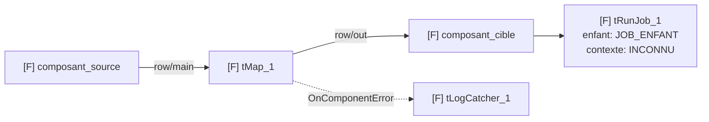
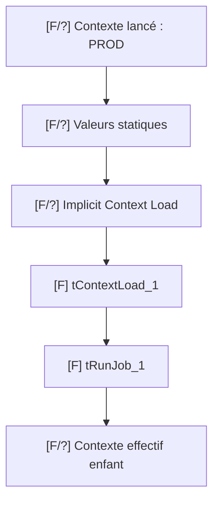
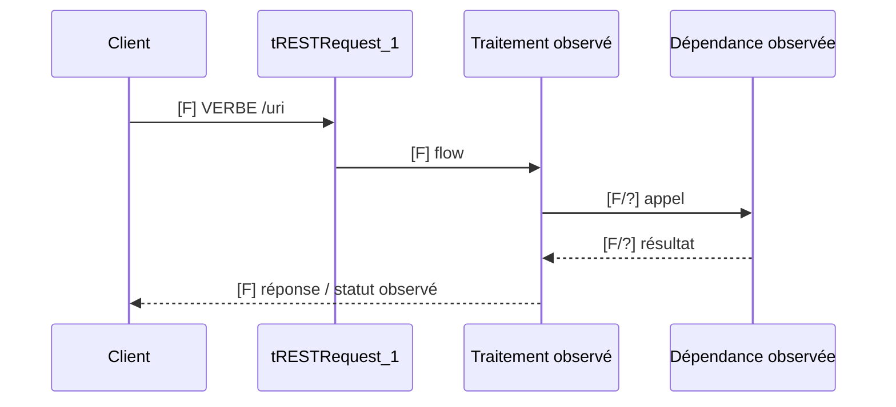

# Visualisation — Graphe Talend et contexte réel

## 1. Quand proposer une représentation

Un diagramme est pertinent si au moins un cas s’applique :

- Job parent + Job enfant ;
- trois composants critiques ou plus ;
- branche d’erreur/rollback ;
- plusieurs écrasements de contexte ;
- flux ESB avec dépendance externe et réponse ;
- explication textuelle ambiguë.

Sinon, une liste courte est plus fiable et moins coûteuse.

## 2. Source du diagramme

Le diagramme doit être construit depuis :

1. `.properties` pour l’identité/version ;
2. `.item` pour les nœuds et connexions ;
3. fichiers de contexte et paramètres observés ;
4. logs pour le chemin réellement exécuté ;
5. scripts d’export fournis pour le contexte de lancement.

L’illustration `docs/illustrations/exemple-job.jpg` du kit est didactique. Elle ne constitue jamais
une preuve du projet analysé.

## 3. Légende de certitude

Utiliser :

- `[F]` fait observé ;
- `[C]` élément proposé dans une conception ;
- `[I]` inférence ;
- `[H]` hypothèse ;
- `[?]` inconnu.

Une arête hypothétique doit être en pointillés. Une valeur sensible est affichée
`****`.

Ne jamais mélanger `[F]` et `[C]` : un composant proposé n’est pas une preuve
qu’il existe déjà dans le projet.

## 4. Diagramme de Job



Remplacer tous les libellés par les noms réellement observés. Supprimer les
nœuds non présents.

## 5. Chronologie du contexte



Sous le diagramme, ajouter un tableau par variable critique :

| Variable | Source initiale | Dernier écrasement prouvé | Valeur affichable | État |
|---|---|---|---|---|
| `context.db_host` | repository | `tContextLoad_1` | `<masqué>` | Fait |

Ne pas afficher une priorité universelle : le dernier écrasement dépend du
chemin et de l’ordre réellement exécutés.

## 6. Diagramme ESB



N’ajouter ni système, ni statut, ni payload non observé.

## 7. Contrôle avant livraison

- tous les nœuds existent dans les sources ;
- chaque lien existe ou est marqué `[H]` ;
- le contexte est réel ou `INCONNU` ;
- les secrets sont masqués ;
- les sources sont listées ;
- le diagramme n’affirme pas quel chemin a tourné sans log ou preuve de trigger ;
- la représentation reste lisible en texte brut.

## 8. Export image

Proposer un export PNG/SVG seulement après validation du Mermaid et si
l’utilisateur en a besoin pour un ticket ou une revue. Conserver le Mermaid
comme source vérifiable.

Pour une conception, le Mermaid est produit depuis le manifeste `[C]`, sans
lecture ni écriture d’un `.item`. Pour un diagnostic, il est produit depuis les
artefacts observés.

## 9. Planche visuelle générée

L’IA peut proposer une planche pédagogique similaire à une infographie de
conception Talend lorsque cela aide le développeur. Cette planche est un dérivé
du graphe validé, jamais une nouvelle interprétation.

### Manifeste obligatoire avant génération

```text
Artefact : <Job/Route/Service>_<version>
Contexte observé : <nom ou INCONNU>
Composants :
- <uniqueName> | <type> | <sous-job>
Connexions :
- <source> -> <cible> | <type de lien> | <nom du flow>
Paramètres visibles autorisés :
- <composant> | <paramètre> | <valeur non sensible ou MASQUÉE>
Hypothèses :
- <élément explicitement marqué H>
```

En mode conception, remplacer les deux premières lignes par :

```text
Mode : CONCEPTION
Produit/build : <observé ou INCONNU>
Composants proposés :
- <uniqueName proposé> | <type exact> | [C]
```

### Exactitude exigée

La planche doit conserver :

- le type exact de chaque composant (`tMap`, `tRunJob`, `tRESTRequest`, etc.) ;
- le `uniqueName` observé, sauf si le rapport choisit un alias explicite ;
- le nombre de composants ;
- les sources, cibles, sens et types de connexions ;
- les noms de Jobs enfants et contextes prouvés ;
- les branches d’erreur et statuts seulement lorsqu’ils sont observés ;
- les valeurs sensibles sous la forme `****`.

### Méthode recommandée

1. Générer le Mermaid/SVG exact depuis le manifeste.
2. Utiliser ce SVG comme référence visuelle de la planche.
3. Générer l’habillage pédagogique sans modifier la topologie.
4. Superposer les libellés exacts de façon déterministe si nécessaire.
5. Comparer la planche finale au manifeste ligne par ligne.

Les générateurs d’images peuvent déformer le texte. Ils ne doivent donc pas
être la seule source des noms de composants, paramètres ou connexions.

### Mention obligatoire

Diagnostic :

```text
Schéma généré depuis les artefacts Talend analysés — pas une capture Talend Studio.
```

Conception :

```text
Conception proposée — à réaliser manuellement dans Talend Studio — pas une capture Studio.
```

### Échec du contrôle

Si un composant, lien, libellé ou contexte diffère :

- ne pas livrer la planche comme représentation exacte ;
- régénérer à partir du SVG validé ;
- ou livrer uniquement le Mermaid/SVG source.

Ne jamais fabriquer un faux écran Talend Studio présenté comme une capture
réelle.
