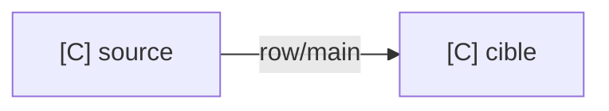

# Conception Talend — <objectif>

> Conception proposée à réaliser manuellement dans Talend Studio.

## 1. Cadrage

| Champ | Valeur |
|---|---|
| Produit/build | ... / `INCONNU` |
| Framework | ... |
| Source | ... |
| Cible | ... |
| Volume | ... / `INCONNU` |
| Action attendue | ... |
| Rejet/reprise | ... / `INCONNU` |

## 2. Architecture proposée

...

## 3. Composants

| Nom proposé | Type exact | Rôle | Requis/optionnel | Source officielle |
|---|---|---|---|---|
| ... | ... | ... | ... | ... |

## 4. Manifeste

```text
Mode : CONCEPTION
Composants proposés :
- ...
Connexions proposées :
- ...
Hypothèses :
- ...
```

## 5. Diagramme



## 6. Configuration manuelle dans Talend Studio

1. ...
2. ...

## 7. Tests

- [ ] ...

## 8. Risques et inconnues

- ...

