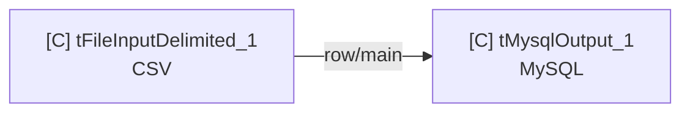
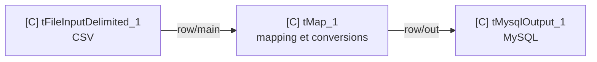

# Pattern Talend — CSV vers MySQL

## Portée

- Job DI **Standard** ;
- Talend TOS DI/ESB 8.0.1 ou Studio 8.x, sous réserve du build et de la Palette ;
- lecture d’un fichier CSV puis écriture dans une table MySQL ;
- conception manuelle, sans génération de `.item` ou `.properties`.

```text
Conception proposée à réaliser manuellement dans Talend Studio.
```

## 1. Choix minimal

| Composant | Statut | Rôle | Pourquoi |
|---|---|---|---|
| `tFileInputDelimited` | requis | lire le CSV selon son schéma | composant Standard prévu pour les fichiers délimités |
| `tMysqlOutput` | requis | écrire le flux dans une table MySQL | composant Standard de sortie MySQL |
| `tMap` | conditionnel | mapper, convertir, filtrer ou enrichir | inutile si source et cible sont déjà strictement compatibles |

Ne pas ajouter `tMap` par réflexe. Le graphe minimal est :



Si les noms, types, valeurs par défaut ou règles métier diffèrent :



`[C]` indique une conception proposée, pas un Job observé.

## 2. Réglages essentiels

### `tFileInputDelimited`

| Réglage | Proposition |
|---|---|
| Property type | `Repository` si le schéma fichier existe et doit être partagé ; sinon `Built-In` |
| File Name/Stream | `context.input_file`, de type `File`, résolu en chemin absolu |
| Row separator | valeur réelle du fichier |
| Field separator | caractère réel ; un seul caractère avec `CSV options` |
| CSV options | définir l’échappement et le text enclosure réellement utilisés |
| Header | nombre réel de lignes d’en-tête, souvent `1` mais jamais supposé |
| Encoding | encodage confirmé du fichier |
| Schema | noms, ordre, types et nullabilité du CSV |
| Skip empty rows | selon le contrat d’entrée |
| Die on error | selon la stratégie : arrêt immédiat ou collecte via `Row > Reject` |

### `tMap` si nécessaire

- relier explicitement chaque colonne source à la cible ;
- convertir les types de façon visible, notamment dates et nombres ;
- définir le traitement des `null`, valeurs par défaut et lignes invalides ;
- éviter de dépendre uniquement de l’auto-conversion ;
- créer une sortie de rejet seulement si une règle métier la justifie.

### `tMysqlOutput`

| Réglage | Proposition |
|---|---|
| Property type | `Repository` si la connexion MySQL est centralisée ; sinon paramètres de contexte |
| DB Version | version MySQL réellement utilisée |
| Host / Port / Database / Username | variables de contexte, sans valeur sensible dans le rapport |
| Password | variable de contexte de type `Password` |
| Table | table cible confirmée |
| Action on table | `Default`/aucune opération pour une table existante ; toute création, suppression, vidage ou troncature exige une demande explicite |
| Action on data | `Insert` pour un chargement append ; upsert/update/delete seulement avec stratégie et clés confirmées |
| Schema | aligné sur la table ; marquer les clés requises par update/delete |
| Die on error | arrêt ou `Row > Reject` selon la politique de rejet |
| Batch/Extend Insert | seulement après confirmation du volume, de la transaction et mesure de performance |

Ne jamais proposer `Drop and create`, `Clear` ou `Truncate` comme valeur par
défaut.

## 3. Connexion et transaction optionnelles

Ajouter `tMysqlConnection`, `tMysqlCommit`, `tMysqlRollback` et `tMysqlClose`
uniquement si la demande exige une connexion réutilisée ou une transaction
contrôlée. Dans ce cas, vérifier les triggers de succès/erreur et ne pas
confondre batch de performance et capacité de rollback.

## 4. Informations qui changent la conception

Demander ou marquer `INCONNU` :

1. séparateur, en-tête, encodage et exemple de schéma CSV ;
2. schéma de la table cible et clés ;
3. append, remplacement logique, update ou upsert ;
4. politique de rejet et de reprise ;
5. ordre de grandeur du volume.

## 5. Tests manuels

- [ ] Prévisualiser quelques lignes du CSV dans Talend Studio.
- [ ] Comparer le schéma propagé au schéma MySQL.
- [ ] Tester d’abord sur une table/environnement non productif.
- [ ] Vérifier `NB_LINE`, lignes insérées/mises à jour et rejets.
- [ ] Tester séparateur, guillemets, caractères accentués, dates et `null`.
- [ ] Tester un doublon de clé selon l’action choisie.
- [ ] Vérifier commit/rollback si une transaction explicite est utilisée.

## 6. Sources officielles

- [`tFileInputDelimited` Standard](https://help.qlik.com/talend/en-US/components/8.0/delimited/tfileinputdelimited-standard-properties)
- [`tMap` Standard](https://help.qlik.com/talend/en-US/components/8.0/tmap/tmap-standard-properties)
- [`tMysqlOutput` Standard](https://help.qlik.com/talend/en-US/components/8.0/mysql/tmysqloutput-standard-properties)
- [Famille des composants MySQL](https://help.qlik.com/talend/en-US/components/8.0/mysql/mysql-component)
- [Disponibilité des composants Studio 8](https://help.qlik.com/talend/en-US/studio-components-availability/8.0/studio-components-availability)

Consultées le : 2026-07-29.

